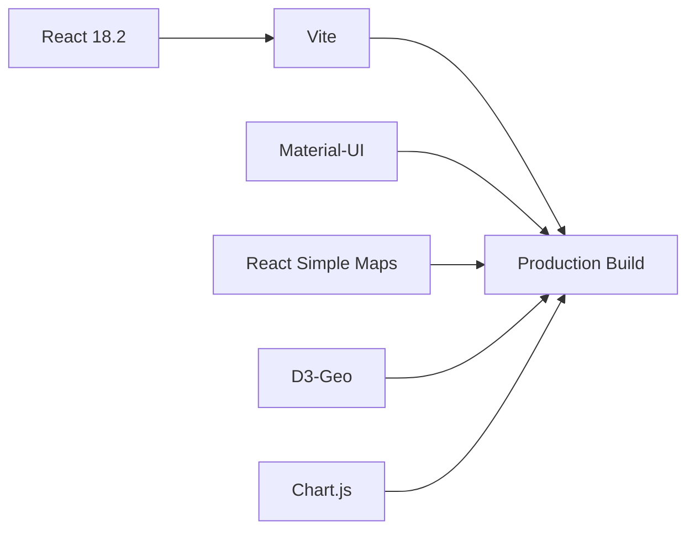
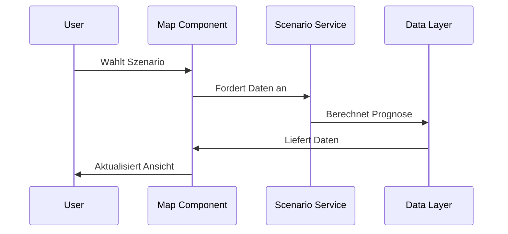

# 🌍 Klimawandel-Visualisierung

<div align="center">

[](https://reactjs.org/)
[](https://vitejs.dev/)
[](https://mui.com/)
[](./LICENSE)

Eine moderne Webanwendung zur interaktiven Visualisierung von Klimawandelszenarien und deren globalen Auswirkungen. Erkunde verschiedene Zukunftsszenarien und verstehe die regionalen Unterschiede der Klimaerwärmung.

[Demo ansehen](https://climatechange-demo.vercel.app) • [Dokumentation](#dokumentation) • [Installation](#installation) • [Mitwirken](#mitwirken)


</div>

## ✨ Hauptfunktionen

### 🗺️ Interaktive Weltkarte
- **Dynamische Temperaturvisualisierung**
  - Farbcodierte Marker zeigen Temperaturänderungen
  - Intuitive Farbskala von grün (geringer Anstieg) bis rot (starker Anstieg)
  - Hover-Effekte mit detaillierten Temperaturinformationen
- **Fortschrittliche Kartenfunktionen**
  - Smooth Zoom & Pan für präzise Navigation
  - Responsive Design für alle Bildschirmgrößen
  - Optimierte Performance durch React Simple Maps

### 📊 Szenario-Analyse
- **Drei wissenschaftlich fundierte Szenarien**
  ```
  🌱 Optimistisch  │ ~1.5°C bis 2100 │ Paris-Ziele erreicht
  📊 Moderat      │ ~2.6°C bis 2100 │ Teilweise Reduktion
  ⚠️ Pessimistisch │ ~4.1°C bis 2100 │ Business as usual
  ```
- **Echtzeit-Szenarienvergleich**
  - Sofortige Aktualisierung der Visualisierung
  - Vergleichsansicht der Auswirkungen
  - Wissenschaftliche Grundlage (IPCC-Berichte)

### ⏳ Zeitliche Entwicklung
- **Innovative Zeitleiste**
  - Stufenlose Navigation von 2025 bis 2100
  - Animierte Temperaturentwicklung
  - Geschwindigkeitssteuerung der Animation
- **Datenpunkte**
  - 5-Jahres-Intervalle für präzise Analysen
  - Trendlinien und Prognosen
  - Historische Vergleichsdaten

### 📍 Regionale Statistiken
- **Detaillierte Regionalanalyse**
  - Aufschlüsselung nach Kontinenten und Regionen
  - Vergleich von Küsten- und Binnenregionen
  - Risikobewertung für Metropolregionen
- **Statistische Auswertung**
  - Durchschnittstemperaturen pro Region
  - Extremwerte und Ausreißer
  - Konfidenzintervalle der Prognosen

## 🛠️ Technologie-Stack



- **Frontend Framework**: React 18.2 mit Vite
  - Moderne React Features (Hooks, Suspense)
  - Optimierte Build-Performance
  - Hot Module Replacement

- **UI/UX**: Material-UI v5
  - Responsive Design System
  - Dark/Light Mode Support
  - Custom Theming

- **Kartographie**: React Simple Maps
  - TopoJSON Integration
  - D3-Geo Projektionen
  - Optimierte Vektor-Grafiken

- **Datenvisualisierung**: Chart.js
  - Interaktive Graphen
  - Echtzeitaktualisierung
  - Responsive Charts

## ⚡ Schnellstart

### 📦 Installation

```bash
# Repository klonen
git clone https://github.com/ttvtimotheus/climatechange.git

# In Projektverzeichnis wechseln
cd climatechange

# Dependencies installieren mit npm
npm install

# Entwicklungsserver starten
npm run dev
```

### 🎯 Erste Schritte

1. **Szenario wählen**
   ```
   Klicke auf eines der drei Szenarien in der oberen Leiste
   ```

2. **Zeit einstellen**
   ```
   Nutze den Slider oder Play-Button für die Zeitnavigation
   ```

3. **Regionen erkunden**
   ```
   Zoome und verschiebe die Karte, klicke auf Marker
   ```

## 📚 Dokumentation

### 🏗️ Projektstruktur

```
climatechange/
├── src/
│   ├── components/        # React Komponenten
│   │   ├── Map.jsx       # Hauptkartenkomponente
│   │   ├── WorldMap.jsx  # 2D Kartenimplementierung
│   │   └── RegionalStats # Regionale Statistiken
│   ├── services/         # Business Logic
│   │   └── globeService  # Datengenerierung
│   └── theme/            # MUI Theming
├── public/               # Statische Assets
└── package.json         # Projektabhängigkeiten
```

### 🔄 Datenfluss



## 🌱 Mitwirken

Wir freuen uns über Beiträge! So kannst du helfen:

1. 🍴 Fork das Projekt
2. 🔨 Feature Branch erstellen (`git checkout -b feature/AmazingFeature`)
3. 💾 Änderungen committen (`git commit -m 'Add: Amazing Feature'`)
4. 📤 Branch pushen (`git push origin feature/AmazingFeature`)
5. 🔄 Pull Request öffnen

## 📊 Datenquellen

Unsere Klimadaten basieren auf:

- **IPCC AR6 Szenarien**
  - RCP2.6 → Optimistisches Szenario
  - RCP4.5 → Moderates Szenario
  - RCP8.5 → Pessimistisches Szenario

- **Wissenschaftliche Grundlagen**
  - Peer-reviewed Klimastudien
  - Satellitengestützte Messungen
  - Historische Klimadaten

## 📜 Lizenz

Dieses Projekt ist unter der MIT-Lizenz lizenziert - siehe [LICENSE](LICENSE) für Details.

## 📫 Kontakt

Timo Haseloff
- 📧 [E-Mail](mailto:info@t-haseloff.de)
- 🌐 [Website](https://t-haseloff.de)
- 💼 [LinkedIn](https://linkedin.com/in/timo-haseloff)

---

<div align="center">

Made with ❤️ in Deutschland

</div>
